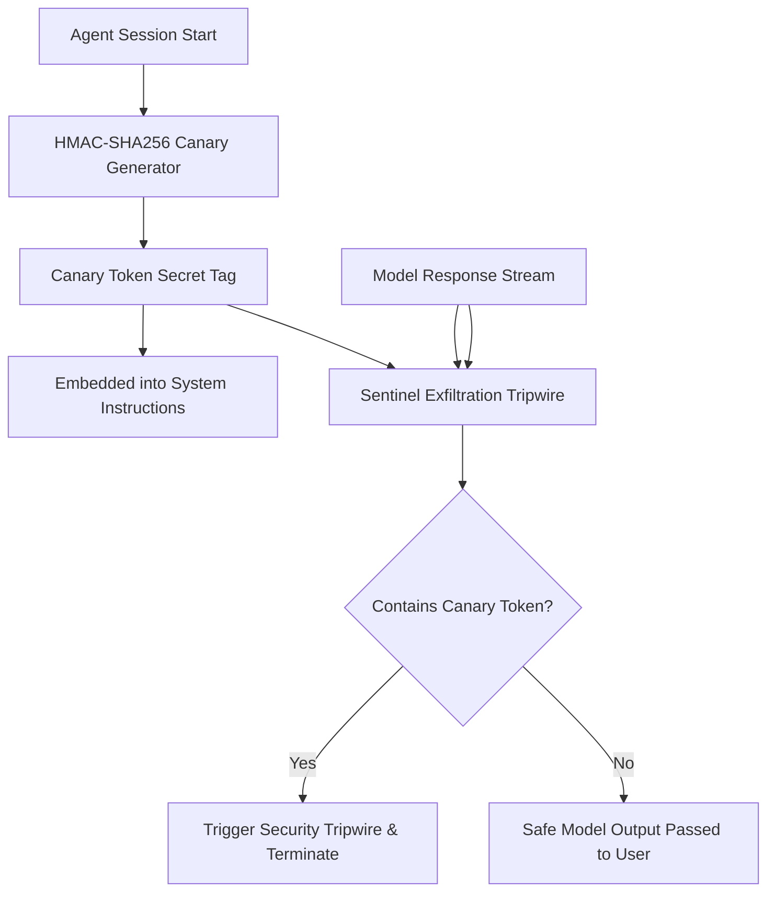

# genpark-canary-token-leak-sentinel-skill

Agent Skill implementing **HMAC-Authenticated Canary Tokens & Exfiltration Tripwire Defense** in 100% Python standard library.

## Architectural Flow

```mermaid
flowchart TD
    Session["Agent Session Start"] --> Gen["HMAC-SHA256 Canary Generator"]
    Gen --> Token["Canary Token Secret Tag"]
    Token --> Injected["Embedded into System Instructions"]
    LLM["Model Response Stream"] --> Sentinel["Sentinel Exfiltration Tripwire"]
    Token & LLM --> Sentinel
    Sentinel --> Check{"Contains Canary Token?"}
    Check -->|Yes| Alert["Trigger Security Tripwire & Terminate"]
    Check -->|No| SafePass["Safe Model Output Passed to User"]
```
